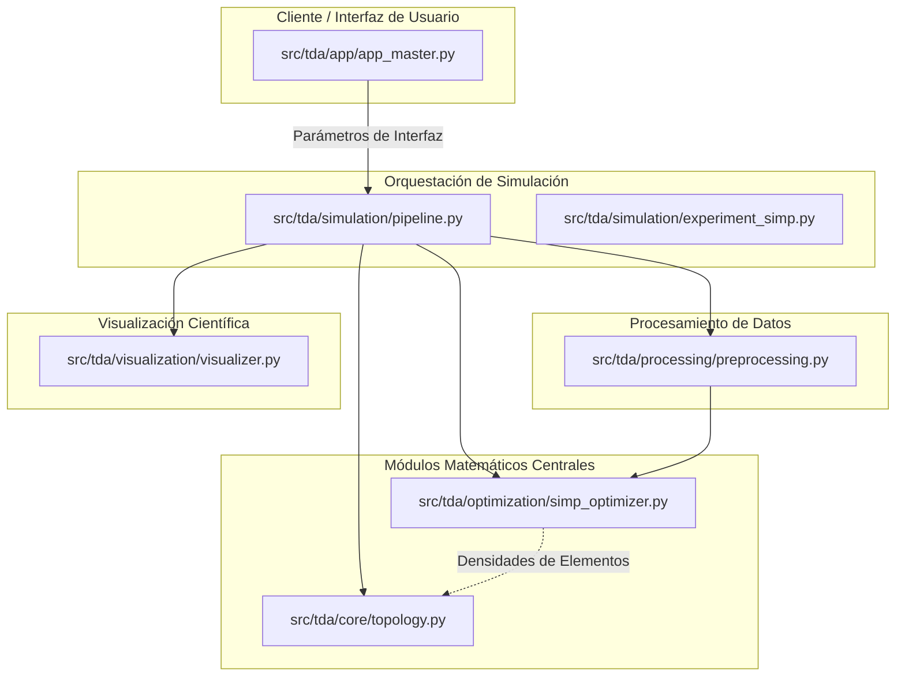

# TDA-SIMP: Framework de Análisis Topológico de Datos aplicado a la Optimización Estructural

Este repositorio implementa un marco metodológico y computacional que unifica el **Análisis Topológico de Datos (TDA)** y la **Optimización Estructural** a través del método **SIMP** (Solid Isotropic Material with Penalization). Desarrollado bajo un paradigma cuantitativo y positivista, el framework permite estudiar la evolución de invariantes topológicos en procesos de optimización y analizar la robustez y estabilidad de descriptores algebraico-topológicos frente al ruido.

---

## 1. Contexto y Problema Científico

En la ingeniería de diseño estructural y de análisis de datos de alta dimensión, los métodos tradicionales basados puramente en geometría euclidiana y análisis infinitesimal local presentan limitaciones fundamentales:
* **Falta de Control Topológico:** Métodos numéricos como SIMP son altamente efectivos para reducir la *compliance* global distribuyendo material de forma óptima bajo restricciones de volumen. Sin embargo, carecen de control directo sobre los invariantes topológicos (como el número de Betti $\beta_1$, que describe el número de agujeros independientes). Esto genera topologías complejas, difíciles de manufacturar debido a micro-vacíos o agujeros no intencionales.
* **Desacoplamiento Metodológico:** La caracterización de la forma de las estructuras y el análisis de estabilidad ante ruido en nubes de puntos de sensores se han tratado tradicionalmente de forma aislada.

Existe un vacío metodológico en la integración de descriptores algebraicos estables derivados de la **homología persistente** para regularizar o auditar de forma sistemática el proceso de convergencia de optimizadores estructurales. Este proyecto aborda dicha brecha, implementando un pipeline integrado en el que la homología persistente actúa como métrica de control de calidad y complejidad topológica *post hoc* sobre los diseños resultantes del algoritmo SIMP.

---

## 2. Hipótesis de Investigación

El desarrollo de este framework está guiado por dos hipótesis específicas de investigación, formuladas operacionalmente sobre métricas cuantificables de rendimiento:

* **H.E.1 — Estabilidad en Análisis Topológico de Datos (TDA):**
  La homología persistente, computada sobre nubes de puntos $X \subset \mathbb{R}^d$ ($d \le 100$) mediante filtraciones de Vietoris-Rips utilizando `Ripser 0.6`, proporciona números de Betti $\beta_0$ (componentes conexas) y $\beta_1$ (ciclos 1-dimensionales) que permanecen estables bajo perturbaciones de ruido gaussiano de magnitud entre el $15\%$ y $20\%$ del diámetro del conjunto de datos. Esta estabilidad supera a la de descriptores geométricos clásicos en tareas de caracterización de formas bajo ruido.

* **H.E.2 — Eficiencia y Convergencia en Optimización Estructural (SIMP):**
  El método SIMP formulado con un factor de penalización $p = 3$ y una fracción de volumen objetivo $f_V = 0.5$ converge a una distribución óptima de densidades que reduce la *compliance* global en al menos un $40\%$ en comparación con el bloque sólido inicial de referencia. La topología sólida binaria resultante posee un número de Betti $\beta_1(\Omega_{\text{sólido}}) \le 2$, verificado computacionalmente mediante análisis de homología sobre su representación en malla de elementos finitos.

---

## 3. Arquitectura del Sistema

La arquitectura sigue un diseño modular y desacoplado, estructurado de la siguiente forma:



---

## 4. Estructura del Repositorio

El repositorio está organizado como un paquete de Python instalable. A continuación se detallan las responsabilidades de cada directorio y archivo clave:

```text
EstructuraTopologica/
├── LICENSE                      # Licencia BSD-3-Clause
├── setup.py                     # Archivo de configuración para la instalación del paquete
├── requirements.txt             # Dependencias exactas del proyecto (105 paquetes validados)
├── install_package.sh           # Script de instalación automatizada para Linux/macOS
├── install_package.bat          # Script de instalación automatizada para Windows
├── prompt.md                    # Instrucciones de diseño del proyecto
├── README.md                    # Este archivo de documentación central
├── docs/
│   └── optimizacion_topologica.md  # Documentación extendida del marco teórico
└── src/
    └── tda/
        ├── __init__.py              # Inicialización del namespace tda
        ├── analysis/                # Análisis topológico y métricas de validación
        │   ├── __init__.py
        │   ├── metrics.py           # Accuracy de K-Means y verificación de números de Betti
        │   └── stability.py         # Barrido de ruido gaussiano para validar H.E.1
        ├── app/                     # Interfaz de usuario (Streamlit)
        │   ├── __init__.py
        │   ├── app_master.py        # App principal interactiva (Master App)
        │   └── pages/
        │       ├── __init__.py
        │       └── page_tda_kmedias.py  # Página: TDA vs K-Medias bajo ruido (H.E.1)
        ├── core/                    # Núcleo matemático
        │   ├── __init__.py
        │   ├── fem.py               # Motor FEM Q4: ensamble, solver, sensibilidades, OC
        │   ├── metric.py            # Métrica compuesta μ_α = c + α·β₁ y calibración de α*
        │   └── topology.py          # Homología persistente, filtraciones y números de Betti
        ├── optimization/            # Optimización estructural SIMP
        │   ├── __init__.py
        │   ├── beam_optimizer.py    # Optimización de viga con MDF + SIMP (sin matplotlib)
        │   ├── metric_simp.py       # Algoritmo 1 completo: preprocesado → SIMP → TDA
        │   └── simp_optimizer.py    # Motor FEM y optimizador estructural SIMP 2D
        ├── processing/              # Preprocesamiento de datos
        │   ├── __init__.py
        │   ├── preprocessing.py     # Ruido gaussiano, normalización y preparación de datos
        │   └── sampling.py          # Muestreo sintético: esfera, toro, ruido controlado
        ├── simulation/              # Orquestación de experimentos
        │   ├── __init__.py
        │   ├── experiment_simp.py   # Experimento headless para validar H.E.2 (SIMP)
        │   └── pipeline.py          # Pipeline unificado de ejecución secuencial
        └── visualization/           # Visualización científica
            ├── __init__.py
            ├── plots_tda.py         # Figuras Plotly listas para Streamlit/exportación
            └── visualizer.py        # Graficadores de diagramas de persistencia, barcodes y mallas
```

---

## 5. Instrucciones de Instalación

Se recomienda el uso de un **entorno virtual (`venv`)** para aislar las dependencias. El proyecto incluye scripts automatizados para Linux/macOS y Windows, o podés seguir los pasos manuales.

### Requisitos del Sistema

* **Sistema Operativo:** Linux / macOS / Windows
* **Python:** 3.10 o superior (validado en Python 3.14)
* **Gestor de paquetes:** `pip` (incluido con Python)

### Método rápido — Script automatizado

**Linux / macOS:**

```bash
# Opción 1: Clonar y ejecutar el script
git clone <repo-url> && cd EstructuraTopologica
bash install_package.sh
```

El script verifica que Python esté instalado, crea el entorno virtual en `venv/`, instala las 105 dependencias y te pregunta si querés ejecutar la app.

**Windows:**

```
# Haz doble clic en install_package.bat o ejecutá desde cmd:
install_package.bat
```

### Método manual — paso a paso

```bash
# 1. Crear el entorno virtual
python3 -m venv venv

# 2. Activarlo
source venv/bin/activate       # Linux/macOS
# 0 venv\Scripts\activate.bat  # Windows (cmd)
# 0 .\venv\Scripts\Activate.ps1  # Windows (PowerShell)

# 3. Instalar dependencias
pip install -r requirements.txt

# 4. Instalar paquete local (para imports from tda.*)
pip install -e .

# 5. Verificar instalación
python --version
pip list  # Deberían verse ~60 paquetes instalados
```

### Método alternativo — Conda

Si preferís Conda, podés crear un entorno similar:

```bash
conda create -n tda-simp python=3.11 -y
conda activate tda-simp
pip install -r requirements.txt
pip install -e .
```

> **Nota:** El archivo `requirements.txt` contiene las ~60 dependencias totales (7 explicitas + transitivas), **validadas sin conflictos** contra Python 3.14 en el desarrollo. Es la fuente única de verdad de las dependencias.

### Verificación de la instalación

```bash
# Parado en la raíz del proyecto, con el venv activado:
python -c "import tda; print(tda.__file__)"  # Verifica que el paquete se encuentra
pip check                                       # Verifica que no haya conflictos
```

---

## 6. Instrucciones de Uso

El framework soporta dos modos de ejecución: por línea de comandos (headless) para simulaciones y procesamiento batch, y mediante una aplicación web interactiva en Streamlit.

### Modo 1: Ejecución Headless (Línea de Comandos)

Para ejecutar el pipeline principal y reproducir de forma automática los experimentos y simulaciones definidos en el marco de investigación:

```bash
# Con el venv activado:
python -m tda.simulation.pipeline

# 0 sin activar, usando la ruta directa:
venv/bin/python -m tda.simulation.pipeline      # Linux/macOS
venv\Scripts\python -m tda.simulation.pipeline   # Windows
```

Esto procesará la optimización de una viga en voladizo (cantilever beam), generará los archivos de datos correspondientes en el directorio de salida y computará los números de Betti y diagramas de persistencia de la topología final obtenida.

### Modo 2: Aplicación Master en Streamlit

Para iniciar el panel de control gráfico e interactivo:

```bash
# Con el venv activado:
streamlit run src/tda/app/app_master.py

# 0 sin activar, usando la ruta directa:
venv/bin/streamlit run src/tda/app/app_master.py     # Linux/macOS
venv\Scripts\streamlit run src\tda\app\app_master.py  # Windows
```

Una vez ejecutado, abra el navegador web en la dirección indicada por la consola (usualmente `http://localhost:8501`). La interfaz interactiva le permitirá:

1. Configurar y simular la optimización SIMP 2D de vigas bajo diferentes mallas.
2. Añadir ruido de perturbación a nubes de puntos y evaluar en vivo la estabilidad de los códigos de barra y diagramas de persistencia calculados por Ripser.
3. Exportar resultados visuales en formato PNG y datos analíticos en CSV.

> **Citación:** Si utilizás este framework en publicaciones académicas, por favor referenciá el repositorio y el proyecto de investigación asociado, disponible en la documentación del repositorio.
