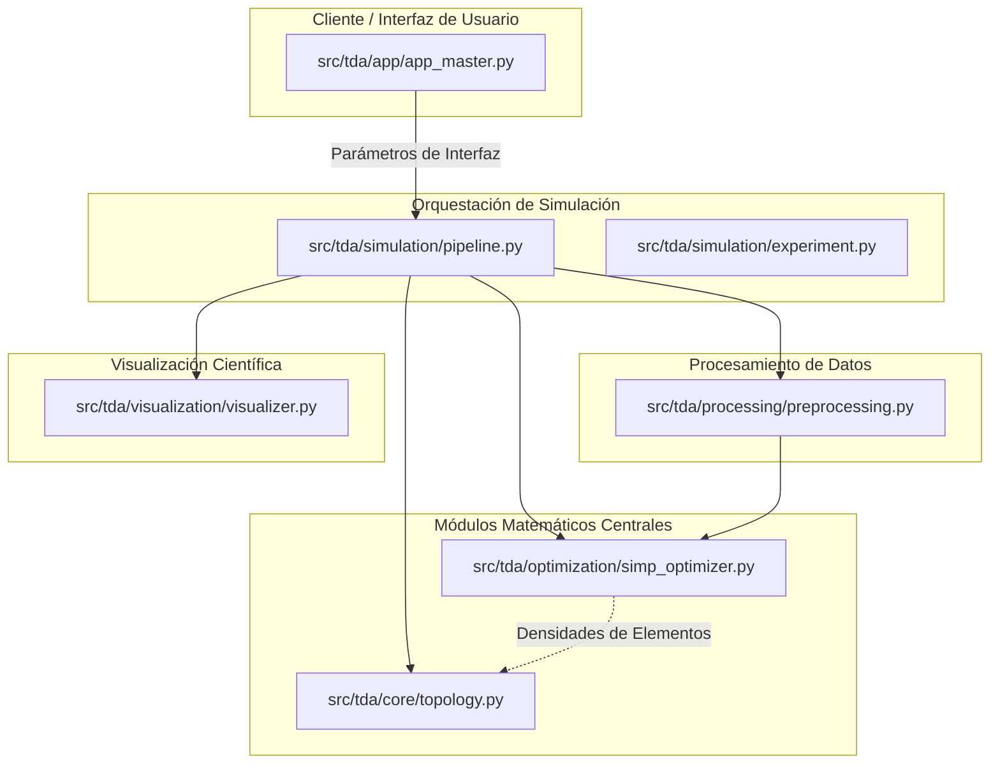

# TDA-SIMP: Framework de Análisis Topológico de Datos aplicado a la Optimización Estructural

Este repositorio implementa un marco metodológico y computacional que unifica el **Análisis Topológico de Datos (TDA)** y la **Optimización Estructural** a través del método **SIMP** (Solid Isotropic Material with Penalization). Desarrollado bajo un paradigma cuantitativo y positivista, el framework permite estudiar la evolución de invariantes topológicos en procesos de optimización y analizar la robustez y estabilidad de descriptores algebraico-topológicos frente al ruido.

---

## 1. Contexto y Problema Científico

En la ingeniería de diseño estructural y de análisis de datos de alta dimensión, los métodos tradicionales basados puramente en geometría euclidiana y análisis infinitesimal local presentan limitaciones fundamentales:
* **Falta de Control Topológico:** Métodos numéricos como SIMP son altamente efectivos para reducir la *compliance* global distribuyendo material de forma óptima bajo restricciones de volumen. Sin embargo, carecen de control directo sobre los invariantes topológicos (como el número de Betti $\beta_1$, que describe el número de agujeros independientes). Esto genera topologías complejas, difíciles de manufacturar debido a micro-vacíos o agujeros no intencionales.
* **Desacoplamiento Metodológico:** La caracterización de la forma de las estructuras y el análisis de estabilidad ante ruido en nubes de puntos de sensores se han tratado tradicionalmente de forma aislada.

Existe un vacío metodológico en la integración de descriptores algebraicos estables derivados de la **homología persistente** para regularizar o auditar de forma sistemática el proceso de convergencia de optimizadores estructurales. Este proyecto aborda dicha brecha, implementando un pipeline integrado en el que la homología persistente actúa como métrica de control de calidad y complejidad topológica *post hoc* sobre los diseños resultantes del algoritmo SIMP.

---

## 2. Hipótesis de Investigación

El desarrollo de este framework está guiado por dos hipótesis específicas de investigación, formuladas operacionalmente sobre métricas cuantificables de rendimiento:

* **H.E.1 — Estabilidad en Análisis Topológico de Datos (TDA):**
  La homología persistente, computada sobre nubes de puntos $X \subset \mathbb{R}^d$ ($d \le 100$) mediante filtraciones de Vietoris-Rips utilizando `Ripser 0.6`, proporciona números de Betti $\beta_0$ (componentes conexas) y $\beta_1$ (ciclos 1-dimensionales) que permanecen estables bajo perturbaciones de ruido gaussiano de magnitud entre el $15\%$ y $20\%$ del diámetro del conjunto de datos. Esta estabilidad supera a la de descriptores geométricos clásicos en tareas de caracterización de formas bajo ruido.

* **H.E.2 — Eficiencia y Convergencia en Optimización Estructural (SIMP):**
  El método SIMP formulado con un factor de penalización $p = 3$ y una fracción de volumen objetivo $f_V = 0.5$ converge a una distribución óptima de densidades que reduce la *compliance* global en al menos un $40\%$ en comparación con el bloque sólido inicial de referencia. La topología sólida binaria resultante posee un número de Betti $\beta_1(\Omega_{\text{sólido}}) \le 2$, verificado computacionalmente mediante análisis de homología sobre su representación en malla de elementos finitos.

---

## 3. Arquitectura del Sistema

La arquitectura sigue un diseño modular y desacoplado, estructurado de la siguiente forma:



---

## 4. Estructura del Repositorio

El repositorio está organizado como un paquete de Python instalable. A continuación se detallan las responsabilidades de cada directorio y archivo clave:

```text
EstructuraTopologica/
├── setup.py                     # Archivo de configuración para la instalación del paquete
├── prompt.md                    # Instrucciones de diseño del proyecto
├── Proy.Investigacion.txt       # Documento de soporte con el proyecto de investigación
├── README.md                    # Este archivo de documentación central
└── src/
    └── tda/
        ├── __init__.py          # Inicialización del namespace tda
        ├── app/
        │   ├── __init__.py
        │   └── app_master.py    # Interfaz interactiva en Streamlit (Master App)
        ├── core/
        │   ├── __init__.py
        │   └── topology.py      # Homología persistente, filtraciones y números de Betti
        ├── optimization/
        │   ├── __init__.py
        │   └── simp_optimizer.py# Motor FEM y optimizador estructural SIMP 2D
        ├── processing/
        │   ├── __init__.py
        │   └── preprocessing.py # Ruido gaussiano, normalización y preparación de datos
        ├── simulation/
        │   ├── __init__.py
        │   ├── experiment.py    # Definición de experimentos de estabilidad y optimización
        │   └── pipeline.py      # Pipeline unificado para la ejecución secuencial de tareas
        └── visualization/
            ├── __init__.py
            └── visualizer.py    # Graficadores de diagramas de persistencia, barcodes y mallas
```

---

## 5. Instrucciones de Instalación

Se recomienda el uso de un entorno virtual administrado mediante `Conda` para asegurar la reproducibilidad de los experimentos y aislar las dependencias numéricas y topológicas críticas.

### Requisitos del Sistema
* **Sistema Operativo:** Linux / macOS / Windows
* **Administrador de paquetes:** Conda (Miniconda/Anaconda)
* **Versión de Python:** 3.11

### Creación del Entorno Conda

Ejecute la siguiente secuencia de comandos en su terminal para crear el entorno, instalar las dependencias con sus versiones exactas y configurar el paquete en modo editable:

```bash
# 1. Crear el entorno conda con Python 3.11
conda create -n tda-simp python=3.11 -y

# 2. Activar el entorno
conda activate tda-simp

# 3. Instalar las dependencias numéricas y gráficas de los canales oficiales y conda-forge
conda install -c conda-forge numpy=1.26 scipy=1.12 matplotlib=3.8 scikit-learn=1.4 streamlit=1.35.0 -y

# 4. Instalar PyTorch (versión CPU o GPU según disponibilidad)
conda install pytorch=2.2.0 cpuonly -c pytorch -y

# 5. Instalar bibliotecas específicas de TDA (Ripser y Persim)
pip install ripser==0.6.4 persim==0.3.5

# 6. Instalar el framework actual en modo editable
pip install -e .
```

---

## 6. Instrucciones de Uso

El framework soporta dos modos de ejecución: por línea de comandos (headless) para simulaciones y procesamiento batch, y mediante una aplicación web interactiva en Streamlit.

### Modo 1: Ejecución Headless (Línea de Comandos)

Para ejecutar el pipeline principal y reproducir de forma automática los experimentos y simulaciones definidos en el marco de investigación:

```bash
# Ejecutar el pipeline de simulación por defecto (SIMP + Análisis Topológico post hoc)
python -m tda.simulation.pipeline
```

Esto procesará la optimización de una viga en voladizo (cantilever beam), generará los archivos de datos correspondientes en el directorio de salida y computará los números de Betti y diagramas de persistencia de la topología final obtenida.

### Modo 2: Aplicación Master en Streamlit

Para iniciar el panel de control gráfico e interactivo que permite ajustar parámetros del optimizador SIMP (como la fracción de volumen, el factor de penalización y la resolución de la malla) y del análisis topológico (umbral de filtración, ruido gaussiano) en tiempo real:

```bash
# Iniciar la aplicación web de Streamlit
streamlit run src/tda/app/app_master.py
```

Una vez ejecutado, abra el navegador web en la dirección indicada por la consola (usualmente `http://localhost:8501`). La interfaz interactiva le permitirá:
1. Configurar y simular la optimización SIMP 2D de vigas bajo diferentes mallas.
2. Añadir ruido de perturbación a nubes de puntos y evaluar en vivo la estabilidad de los códigos de barra y diagramas de persistencia calculados por Ripser.
3. Exportar resultados visuales en formato PNG y datos analíticos en CSV.
