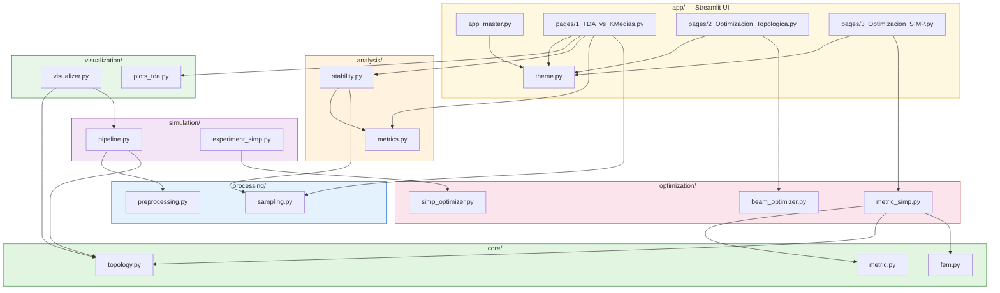

## Exploration: Estructura Actual del Proyecto TDA-SIMP

### Current State

El proyecto **EstructuraTopologica** es un framework académico (tesis de maestría) que unifica **Análisis Topológico de Datos (TDA)** con **Optimización Estructural (SIMP)**. Está implementado como un paquete Python instalable bajo `src/tda/`, con un pipeline modular que va desde generación de datos sintéticos → preprocesamiento → optimización SIMP → análisis topológico → visualización.

La aplicación se ejecuta via **Streamlit** (3 páginas interactivas) o por **línea de comandos** (headless) para experimentos batch.

### Módulos y Propósito

| Módulo | Archivo(s) | LOC | Propósito |
|--------|-----------|-----|-----------|
| `core/` | `fem.py`, `topology.py`, `metric.py` | 445 | Núcleo matemático: FEM Q4, homología persistente (Ripser), métrica compuesta μ_α |
| `analysis/` | `metrics.py`, `stability.py` | 156 | Accuracy K-Means, verificación de Betti, barrido de ruido gaussiano (H.E.1) |
| `processing/` | `preprocessing.py`, `sampling.py` | 151 | Preprocesamiento de diagramas, muestreo sintético (esfera, toro), ruido gaussiano |
| `simulation/` | `pipeline.py`, `experiment_simp.py` | 394 | Orquestación de experimentos: pipeline TDA, experimento headless SIMP (H.E.2) |
| `optimization/` | `simp_optimizer.py`, `metric_simp.py`, `beam_optimizer.py` | 845 | Optimización SIMP 2D (dos implementaciones), optimización de vigas 1D, Algoritmo 1 |
| `visualization/` | `visualizer.py`, `plots_tda.py` | 767 | Visualización matplotlib/Plotly: diagramas de persistencia, estabilidad, comparaciones |
| `app/` | `app_master.py`, `theme.py`, `pages/{1,2,3}.py` | 2,542 | Interfaz Streamlit, 3 páginas interactivas, tema oscuro/claro, exportación |

**Total**: ~5,300 líneas de Python en `src/tda/`, más 95 líneas de tests.

### Dependencias entre Módulos (Quién importa a Quién)

### Patrones de Código y Arquitectura

**Fortalezas:**
- Separación clara de módulos por responsabilidad (capa matemática, capa de análisis, capa de UI)
- `MetricaTDA_SIMP` (`metric_simp.py`) es el punto de entrada limpio para el pipeline completo (Algoritmo 1)
- La clase expone `obtener_resultados()` como dict desacoplado de la UI — buen patrón
- `core/__init__.py` re-exporta todas las funciones — permite `from tda.core import ...`
- Soporte de modo oscuro/claro en la app via `theme.py`
- Exportación multi-formato (CSV, PDF, PNG, LaTeX)

**Deuda Técnica Detectada:**

1. **Código duplicado**: `generate_cloud()`, `add_gaussian_noise()`, `compute_diameter()` existen tanto en `processing/sampling.py` como en `simulation/pipeline.py` con implementaciones ligeramente distintas (p.ej., `pipeline.py` incluye cubo, `sampling.py` no).

2. **Dos motores SIMP**: `simp_optimizer.py` (SimpTda2DOptimizer, autocontenido, duplica lógica FEM) vs `metric_simp.py` (MetricaTDA_SIMP, usa `tda.core.fem`). El primero parece ser anterior, el segundo la versión refactorizada. No hay ruta de deprecación.

3. **`sys.path.insert(0, ...)` frágil**: `visualizer.py` y `pipeline.py` mutan `sys.path` al importar. Señal de que el package discovery no está funcionando limpiamente sin `pip install -e .`.

4. **Hardcoding de parámetros**: Umbrales de persistencia (1.5, 2.0), config de malla, niveles de ruido están hardcodeados en múltiples lugares.

5. **`beam_optimizer.py` con dead code**: `evaluar_funcion()` llama a `D_viga_idealizada()` que es un placeholder (`return np.ones_like(K) * 0.01`). `solve_generator()` también parece experimental/incompleto.

6. **Test coverage casi nulo**: Solo 2 archivos de test (~95 LOC) que verifican imports y formas de matrices. Sin tests de lógica real. Config pide 80% de cobertura, imposible de alcanzar.

7. **Nomenclatura mixta**: Funciones en español (`binarizar_y_extraer_nube`, `calcular_homologia_betti`, `ensamblar_K_global`) coexisten con funciones en inglés (`wasserstein_distance`, `compute_noise_sweep`, `generate_cloud`).

8. **`setup.py` + `pyproject.toml`**: Ambos existen, potencialmente redundantes. `pyproject.toml` define ruff y pytest config, pero `setup.py` también está presente.

### Approaches

Si se quisiera refactorizar la estructura, hay tres enfoques:

1. **Consolidación de módulos duplicados** — Unificar `generate_cloud` y relacionadas en `processing/sampling.py`, eliminar duplicados de `pipeline.py`.
   - Pros: Elimina deuda técnica, DRY
   - Cons: Cambios en imports de consumidores
   - Effort: Bajo

2. **Deprecación de `simp_optimizer.py`** — Marcar `SimpTda2DOptimizer` como deprecado, migrar `experiment_simp.py` a `MetricaTDA_SIMP`.
   - Pros: Una sola implementación SIMP
   - Cons: Validar que `MetricaTDA_SIMP` cubre todos los casos
   - Effort: Medio

3. **Estandarización de idioma** — Unificar nomenclatura a español o inglés.
   - Pros: Consistencia
   - Cons: Ruido en git history, cambios puramente cosméticos
   - Effort: Bajo

### Recommendation

La arquitectura actual es sólida para un proyecto académico. La prioridad más alta debería ser **aumentar test coverage** — particularmente para los módulos `core/fem.py`, `core/topology.py`, y `optimization/metric_simp.py` que contienen la lógica crítica de la tesis. En segundo lugar, **unificar las implementaciones duplicadas** de sampling para prevenir bugs silenciosos. La deprecación de `simp_optimizer.py` puede esperar hasta que haya tests que cubran ambos.

### Risks

- **R1**: La falta de tests en la lógica FEM/TDA significa que cambios futuros pueden romper resultados de investigación sin detección.
- **R2**: El código duplicado en `pipeline.py` vs `sampling.py` puede producir resultados inconsistentes entre ejecuciones headless y la app Streamlit.
- **R3**: Los módulos de página de Streamlit son muy grandes (1,084 LOC la página 3), dificultando mantenimiento y testing.
- **R4**: `beam_optimizer.py` contiene código placeholder que podría confundir a futuros mantenedores.

### Ready for Proposal

**Yes** — el proyecto tiene una estructura clara y bien documentada. La exploración revela puntos específicos de mejora (tests, duplicación, consistencia) que pueden abordarse en propuestas incrementales. La recomendación principal es comenzar por la base de tests antes de cualquier refactor funcional.
